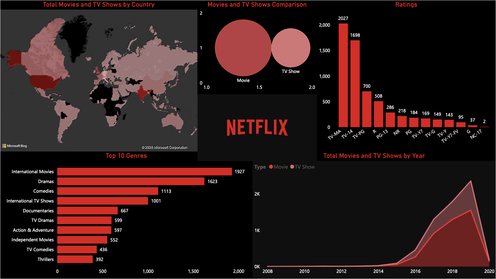

# Netflix Content Distribution & Growth Analysis (Power BI)

An interactive Power BI dashboard analysing Netflix's global content distribution, genre dominance, ratings breakdown, and yearly content growth trends.

## Dashboard Preview

## Project Overview

This project explores Netflix's content catalogue to understand how content is distributed across regions, genres, and ratings. The dashboard highlights patterns in Netflix's content strategy and growth over time.

## Tools & Technologies

- Microsoft Power BI
- Microsoft Power Query
- DAX
- Data Visualisation
- Data Modelling
- Data Transformation

## Key Features

- Dynamic analysis of Movies vs TV Shows
- Geographic mapping of content distribution
- Genre ranking visuals to identify dominant categories
- Yearly content growth trends
- Interactive filtering for deeper exploration

## Key Insights

- Movies account for approximately **68% of the catalogue**
- A major spike in content additions occurred around **2019**
- Certain genres dominate specific geographic regions

## Dataset

Netflix Titles Dataset  
(Source: publicly available dataset commonly used for data analysis practice)

## Author

Sneha Besu  
Computer Science Graduate from UNSW
